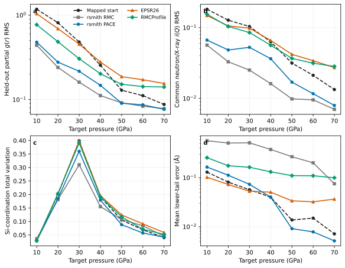
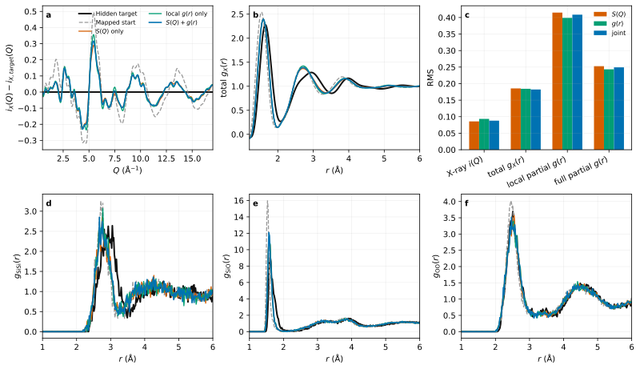

# High-pressure SiO2 recovery benchmark

This benchmark asks whether atomistic refinement can recover the structural
changes produced by compressing an ambient silica glass to 10 GPa. It begins
as a deliberately small synthetic pilot, not as another broad comparison
matrix.

The hidden target is the 3,000-atom Erhard-2024 ACE structure after sequential
0 -> 5 -> 10 GPa loading at 300 K and a 30 ps hold at 10 GPa. The common start
is the saved 0 GPa structure from the same trajectory, mapped by fractional
coordinates into the exact hidden-target box. Consequently the density is
known and fixed; the refinement must recover non-affine topology rather than
infer pressure or volume.

Synthetic neutron and X-ray totals are calculated from the hidden coordinates.
Hidden partial RDFs and Si/O coordination distributions are withheld from the
refinement and used only for scoring. The first gate compares pure rsmith RMC
with rsmith ACE-HRMC at 6,000, 18,000, and 30,000 attempted moves using one
seed. Native EPSR26 is added only if the pilot demonstrates both a measurable
0-to-10 GPa structural gap and useful recovery. This staged rule avoids the
large ambient-pressure matrix being repeated unnecessarily.

Because the hidden target was generated with the same ACE model available to
ACE-HRMC, this is an intentionally favorable synthetic recovery/oracle test.
It can validate algorithmic use of an informative MLIP prior, but cannot by
itself establish experimental accuracy or universal superiority over EPSR.

The protocol is frozen in `expected/ten-gpa-pilot.toml`, and the deterministically
generated fixture is pinned before refinement in
`expected/ten-gpa-pilot-inputs.toml`. Private source structures remain ignored;
hashes, repository commit, generation input, and the public ACE provenance are
committed.

The pilot passed its extension gate. Its observations are recorded in
`expected/ten-gpa-pilot-observed.toml`; the matched-budget EPSR26 comparison is
separately preregistered in `expected/ten-gpa-comparison.toml`. Only the 30,000
move endpoint is replicated over five seeds. The primary seed alone retains
6,000/18,000/30,000-move checkpoints.

## Result

The EPSR-native hidden-coordinate replay passed at `6.48e-9` neutron and
`1.94e-8` X-ray RMS. At the nominally matched 30,000-move endpoint, weight-30
rsmith PACE had lower held-out partial-RDF error than stock EPSR26 in all five
paired seeds. The ensemble medians are:

| Method | Common i(Q) RMS | Hidden partial-RDF RMS | Safety passes | Local wall time |
|---|---:|---:|---:|---:|
| rsmith PACE, weight 30 | 0.06758 | 0.43715 | 0/5 | 95.19 s |
| stock EPSR26 | 0.14807 | 0.94698 | 4/5 | 2.53 s |
| rsmith pure RMC | 0.05619 | 0.41053 | 0/5 | 1.79 s |

PACE therefore recovers 59.5% of the starting hidden-RDF gap, compared with
12.4% for EPSR, and its median error is 53.8% lower. This is a strong recovery
advantage, but the preregistered overall-superiority claim does **not** pass:
every PACE endpoint contains at least one distance below the frozen floors,
principally O-O minima of 1.871--1.966 A. EPSR fails one of five endpoints by a
small Si-Si violation. Pure RMC is still more pathological.

The ACE energy decreases by 0.194--0.198 eV/atom in all five PACE runs, so a
favorable global energy does not guarantee safe local minima. Stock EPSR is
also about 37.6 times faster in these local endpoint timings. The timing is a
diagnostic, not a publication speed ratio, because the implementations and
move semantics differ. The result supports superior hidden-structure recovery
for rsmith on this favorable same-ACE synthetic task, while leaving local
safety unresolved and forbidding a general claim that rsmith is superior to
EPSR.

## Reproduction

```bash
cd benchmarks/hp-sio2
python3 scripts/import_private_sources.py
python3 scripts/prepare_ten_gpa_pilot.py
python3 scripts/run_ten_gpa_pilot.py
python3 scripts/score_ten_gpa_pilot.py
python3 scripts/prepare_ten_gpa_comparison.py
python3 scripts/run_ten_gpa_comparison_rsmith.py
python3 scripts/run_ten_gpa_comparison_epsr.py
python3 scripts/score_ten_gpa_pilot.py
python3 scripts/verify_ten_gpa_comparison.py
```

## Incremental pressure ladder

The next frozen pilot separates the available loading path into 0 -> 5 and
5 -> 10 GPa recovery steps. It uses one seed and one 30,000-move endpoint for
pure RMC, PACE weight 30, and stock EPSR26. This is pressure mapping, not a new
ensemble campaign. The protocol is in `expected/pressure-steps.toml`.
The generated inputs and pre-refinement gap audit are pinned in
`expected/pressure-steps-inputs.toml`.

Following the 10 GPa diagnostic review, no ambient absolute minimum-distance
gate is used. Short-range behavior is compared with the hidden target at the
same pressure through the 0.1% and 1% lower quantiles of the Si-Si, Si-O, and
O-O neighbor-distance distributions, together with counts below those target
quantiles. Absolute minima remain descriptive outlier diagnostics only.

```bash
python3 scripts/import_pressure_steps.py
python3 scripts/prepare_pressure_steps.py
python3 scripts/run_pressure_steps_rsmith.py
python3 scripts/run_pressure_steps_epsr.py
python3 scripts/score_pressure_steps.py
```

The upstream repository now contains the sequential loading endpoints through
200 GPa. The next frozen scan uses every 10 GPa increment through 70 GPa and
adds native RMCProfile to the three existing methods. The four arms are pure
rsmith RMC, rsmith PACE weight 30, the stock EPSR26 executable, and native
RMCProfile 6.7.9.5. Thus `native-epsr26` means the original EPSR26 program, not
rsmith's EPSR-inspired objective.

The 0 -> 10 step is rerun rather than copied from the earlier benchmark so all
seven steps share the same 13.5 A real-space scoring cutoff. RMCProfile uses
zero hard minimum distances: ambient-pressure cutoffs are not defensible at
70 GPa, and pressure-relative lower-tail distributions are instead withheld
for scoring. Native EPSR26 and RMCProfile both generate and replay their own
hidden-coordinate targets before refinement. The protocol, including source
commit and executable hashes, is frozen in
`expected/pressure-series-70.toml` before any outcomes are generated.

```bash
python3 scripts/import_pressure_series_70.py
python3 scripts/prepare_pressure_series_70.py
python3 scripts/run_pressure_series_70_rmcprofile.py --forward-only
python3 scripts/run_pressure_series_70_rsmith.py --only-missing
python3 scripts/run_pressure_series_70_epsr.py --only-missing
python3 scripts/run_pressure_series_70_rmcprofile.py --only-missing
python3 scripts/score_pressure_series_70.py
python3 scripts/verify_pressure_series_70.py
```

This is deliberately a single-seed pressure-trend scan. It can compare how the
four methods respond as pressure rises, but cannot establish universal
superiority, production speed, or stochastic uncertainty.

### 0--70 GPa result

Both native forward/replay gates pass at every pressure: EPSR26 remains below
`1.38e-8` neutron and `4.66e-8` X-ray RMS, while RMCProfile replay is exact at
the stored precision. Every RMCProfile endpoint is audited to exactly 30,000
generated moves. The held-out mean partial-RDF errors are:

| Target pressure | Mapped start | rsmith RMC | rsmith PACE | EPSR26 | RMCProfile |
|---:|---:|---:|---:|---:|---:|
| 10 GPa | 1.17607 | **0.44012** | 0.47914 | 1.03925 | 0.77136 |
| 20 GPa | 0.81465 | **0.24057** | 0.27772 | 0.69210 | 0.48452 |
| 30 GPa | 0.48126 | **0.16091** | 0.21673 | 0.45373 | 0.30509 |
| 40 GPa | 0.25542 | **0.11161** | 0.14761 | 0.27896 | 0.20233 |
| 50 GPa | 0.12928 | 0.09161 | **0.09061** | 0.18702 | 0.15194 |
| 60 GPa | 0.11140 | **0.08360** | 0.08682 | 0.17201 | 0.14273 |
| 70 GPa | 0.08772 | 0.07826 | **0.07672** | 0.15531 | 0.14108 |



PACE beats both native programs on hidden partial RDF, common neutron/X-ray
`i(Q)`, and Si-coordination error in all seven steps. It improves the mapped
start at every pressure, recovering 59.3%, 65.9%, 55.0%, 42.2%, 29.9%, 22.1%,
and 12.5% of the respective hidden-RDF gaps. EPSR26 starts worsening the common
hidden-RDF score at 30 -> 40 GPa and RMCProfile at 40 -> 50 GPa. This is not a
claim that their native objectives fail to decrease; it is the independent
common-coordinate score.

Pure RMC has the lowest hidden-RDF error in five steps and the lowest common
scattering residual in all seven, but its pressure-relative lower-tail error is
worse than PACE in all seven. It creates Si-O minima as low as 0.546 A. PACE
keeps minima within 2.050--2.278 A Si-Si, 1.371--1.472 A Si-O, and
1.929--2.003 A O-O while lowering the ACE energy in every step. Relative to
EPSR, PACE's lower-tail score is worse through 30 GPa but better at 40--70 GPa;
it beats zero-minimum RMCProfile on this diagnostic throughout.

Median local walls are 1.81 s for pure rsmith RMC, 2.84 s for EPSR26, 77.45 s
for RMCProfile, and 208.42 s for PACE. These diagnose the installed adapters,
not equal work or production speed: move semantics and native residuals differ.
The exact arrays and claim boundary are committed in
`expected/pressure-series-70-observed.toml` and checked by
`scripts/verify_pressure_series_70.py`.

The next separate test will exercise rsmith's multi-domain fitting: matched
`S(Q)`-only, local `G(r)`-only, and joint `S(Q)+G(r)` arms, with the X-ray PDF
constructed at `Qmax = 17 inverse Angstrom`. The transform/window, local
real-space range, uncertainties, and relative domain weights must be frozen
before outcomes because the two curves derive from the same scattering data.

### Reciprocal/local-real domain result

The follow-up uses the 20 -> 30 GPa step, where the mapped start has the largest
Si-coordination mismatch in the pressure scan. All three arms use PACE weight
30, one seed, 30,000 moves, and the same X-ray information truncated at
`Qmax = 17 inverse Angstrom`. The normalized total `g_X(r)` is Lorch transformed
and fitted over 1.2--6.0 A. Its constant uncertainty is chosen so the mapped
start has the same unweighted chi-squared in `i(Q)` and `g_X(r)`; the joint arm
assigns weight 0.5 to each, retaining the same total starting data cost.

| Arm | X-ray i(Q) RMS | total g_X(r) RMS | Local partial-RDF RMS | Full partial-RDF RMS | Coordination TV |
|---|---:|---:|---:|---:|---:|
| S(Q) only | **0.08573** | 0.18546 | 0.41484 | 0.25282 | **0.365** |
| local g(r) only | 0.09333 | 0.18440 | **0.39885** | **0.24332** | 0.370 |
| S(Q) + local g(r) | 0.08803 | **0.18218** | 0.40866 | 0.24929 | 0.375 |



The real-space residual changes recovery in the intended local direction:
`g(r)`-only gives the best held-out local and full partial-RDF scores, while
`S(Q)`-only gives the best reciprocal score. The joint arm gives the best fitted
total `g_X(r)` and an `i(Q)` residual between the two single-domain arms, making
it the clearest Pareto compromise. It does not beat `g(r)`-only on held-out
partial structure, so this single seed supports complementary residual
weighting, not universal dual-domain synergy.

All three starts have chi-squared about 16352.7, the joint components are
8176.33 and 8176.40, and acceptance is 21.6--21.8%. Walls are 170.1--173.1 s,
showing negligible domain-transform overhead relative to PACE at this grid
size. The code now also guarantees that `[data.xray_gr]` uses X-ray weights even
when neutron reciprocal data are present; a regression test covers this case.

```bash
python3 scripts/prepare_sq_gr_domain.py
python3 scripts/run_sq_gr_domain.py --only-missing
python3 scripts/score_sq_gr_domain.py
python3 scripts/verify_sq_gr_domain.py
MPLCONFIGDIR=/tmp/rsmith-mpl python3 scripts/plot_pressure_series_70.py
MPLCONFIGDIR=/tmp/rsmith-mpl python3 scripts/plot_sq_gr_domain.py
```

### Incremental result

Both pressure increments are informative and pass their EPSR-native replay
gates at approximately `1e-8` RMS. At 30,000 nominal moves:

| Step | Method | Common i(Q) RMS | Hidden RDF RMS | Mean lower-tail error |
|---|---|---:|---:|---:|
| 0 -> 5 | PACE weight 30 | 0.03200 | 0.26878 | 0.0712 A |
| 0 -> 5 | stock EPSR26 | 0.08156 | 0.74536 | **0.0451 A** |
| 5 -> 10 | PACE weight 30 | 0.02636 | 0.21446 | 0.0584 A |
| 5 -> 10 | stock EPSR26 | 0.07581 | 0.65301 | **0.0400 A** |

PACE recovers 68.6% and 71.3% of the starting hidden-RDF gaps, whereas EPSR
recovers 12.8% and 12.6%. PACE's hidden-RDF errors are 63.9% and 67.2% lower
than EPSR, so the recovery-advantage gate passes in both steps.

The pressure-relative lower-tail guard does not pass. PACE is closer to the
target for the Si-O lower tail, while EPSR is closer for O-O; the frozen
equal-pair mean therefore favors EPSR. Importantly, incremental PACE produces
minima of at least 2.109 A (Si-Si), 1.461 A (Si-O), and 2.117 A (O-O). The
severe short-contact outliers seen in the direct 0 -> 10 jump disappear. This
supports sequential pressure refinement as the appropriate workflow, while
retaining the lower-tail mismatch as a real structural diagnostic rather than
calling it an absolute safety failure.

Pure RMC obtains slightly lower scattering and hidden-RDF errors than PACE but
again develops very short local contacts and much larger lower-tail errors.
PACE energy decreases by 0.052 and 0.049 eV/atom. The result remains a
single-seed, same-ACE inverse-oracle pressure map; the frozen 0--70 GPa scan
above is the next computation.
